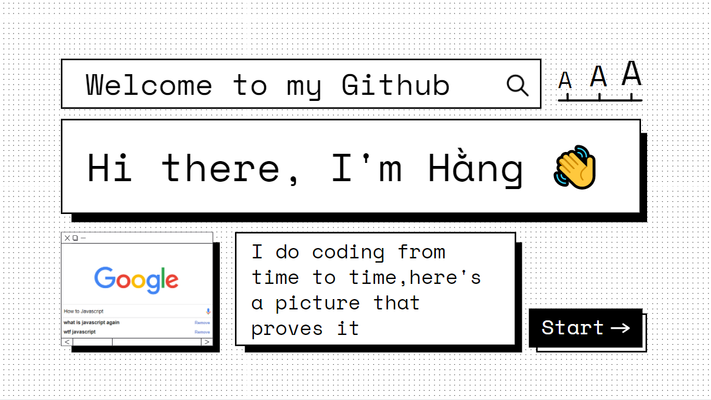

<h3 align="center">Hey there 👋 ╰(*°▽°*)╯ </h3>

<h3 align="center">I'm a Javascript enthusiastic, interested in Frontend and UI/UX 👩‍💻</h3>

- 🎓 Currently a undergrad at Hanoi University of Science and Technology, major in Software Engineering

- 🌱 I’m currently learning: **React JS, Typescript**

- 📫 How to reach me: **phamthanhhang.208@gmail.com**

- 📄 Know about my experiences: [https://bom.to/8nliGG](https://bom.to/8nliGG)

- ⚡ Fun fact: **I like coffee ☕️ , I like retro aesthetic 📺📼 and I like learning 📓💻**

<h3 align="left">Languages and Tools:</h3>

        

&nbsp;

-  Here's some humor for you:

<!--
**phamthanhhang208/phamthanhhang208** is a ✨ _special_ ✨ repository because its `README.md` (this file) appears on your GitHub profile.

Here are some ideas to get you started:

- 🔭 I’m currently working on ...
- 🌱 I’m currently learning ...
- 👯 I’m looking to collaborate on ...
- 🤔 I’m looking for help with ...
- 💬 Ask me about ...
- 📫 How to reach me: ...
- 😄 Pronouns: ...
- ⚡ Fun fact: ...
  -->
