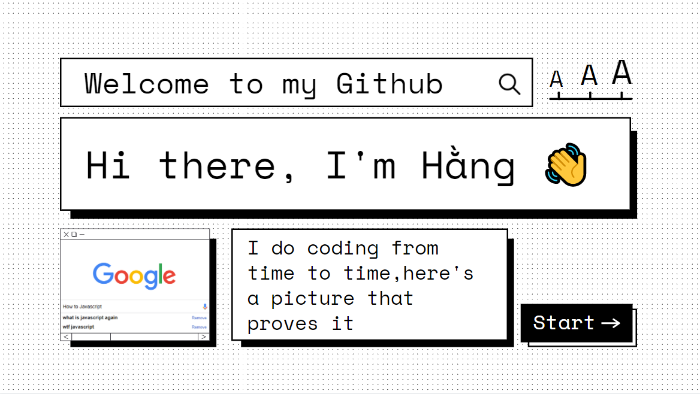

<h2 align="center">Hey there 👋 ╰(°▽°)╯</h2>

  
  
  

---

### About Me

I’m a **Front-end Engineer** passionate about React, TypeScript, and UI/UX 👩‍💻

- 🔭 Currently working as a Front-end Engineer at **Teko**, building DeFi lending & borrowing platforms on Cardano
- 💼 Previously at **Kyber Network** (Trading Dashboards) and **One Mount Group** (Enterprise Inventory Systems)
- 🎓 BSc in Software Engineering from **Hanoi University of Science and Technology** (GPA: 3.43)
- 🌱 Exploring: Advanced State Management (Zustand), Blockchain Integrations, and System Architecture
- ⚡ Fun fact: I run on caffeine ☕️, I’m into mechanical keyboards, and I love building cool things!

---

### Tech Stack

**Languages**

**Frameworks & Libraries**

**Backend & Database**

**Tools**

---

### GitHub Stats

  
  

  

---

   Here’s some humor for you:

  

  

